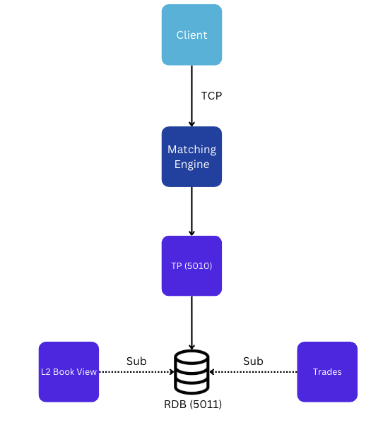

# Matching Engine
Attempting to create a simple OrderBook and Order Matching Engine, following to an extent [Jane Street - How to build an exchange](https://blog.janestreet.com/how-to-build-an-exchange/)

### Architecture


### How It Works

#### Client
The client process connects via a socket (tcp) connection to the engine and sends orders as SBE encoded messages.

There are two types of orders:
- Order
- OrderCancel

##### Order
An order is parameterised by a ticker, quantity, side, price, stpfId [self-trading prevention functionlity](https://www.ice.com/publicdocs/futures/IFEU_Self_Trade_Prevention_Functionality_FAQ.pdf), and stpf instruction.

The order message is 36 bytes, eight for the header, and 28 for the message itself.

##### OrderCancel
An order cancel is parameterised by an orderId.

The order cancel message is 16 bytes, eight for the header, and eight for the message itself.

#### Server/Engine
The engine is single threaded, as a multi-threaded engine introduces many complexities.

Upon startup, there is one thread which handles client connections, and appends orders to a queue.
The other thread reads from this queue and adds orders to the book.

By having the engine single-threaded, there is no need to synchronise any methods of the order book, as we can guarantee there will not be any race-conditions.

When an order hits the engine, the engine sets an attribute of when the order was received, as well as generates a unique, time-ordered orderID (a Snowflake ID). Orders are published to a KDB tickerplant, to an `orders` table.
Similarly, when a trade occurs, the two orders that caused the trade are published to a `trades` table, along with the quantity and price that the trade occured at.

To prevent self-matching, orders with the same stpf id do not trade, and the corresponding stpf instruction occurs on the given orders. This is published to a `marketEvents` table.


### Usage
1. Build
```
make build
```

2. Run the KDB TP and RDB
```
make kdb
```

3. Run the MarketListener
```
make listen
```

4. Send orders
```
make sendorders
```
